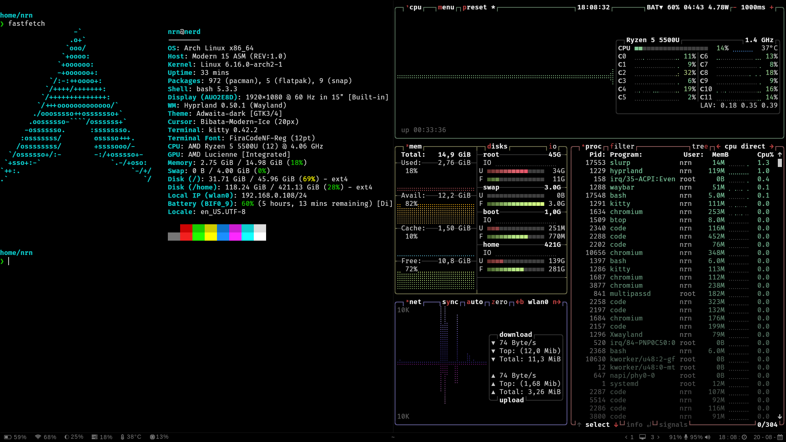

# My Arch + Hyprland Customization ✨

Here’s my setup 👇

You can follow this repo to recreate the same system!

About this setup ✨

I created this setup mainly for programming and development. The goal is to keep everything minimal and distraction-free — no unnecessary icons, widgets, or flashy colors on the desktop. It’s designed to give you a clean workspace that helps you stay focused on coding while still being simple, fast, and efficient.
